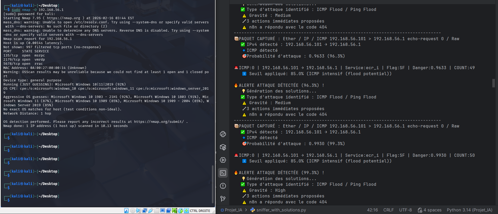

# AI-Cybersecurity-ID
Mini PROJET : Système de détection d'intrusion réseau grâce au Machine Learning (XGBoost + NSL-KDD) avec notifications automatiques sur Discord.

# 📸 Aperçu d'une alerte

Voici à quoi ressemble une alerte de sécurité interceptée et envoyée par notre système :

# Fonctionnalités principales
* **Analyse intelligente** : Utilisation de XGBoost pour classifier le trafic normal ou malveillant.
* **Base de données locale** : Enregistrement sécurisé des logs via SQLite.
* **Automatisation** : Connexion à n8n pour envoyer des alertes (ex: Discord) sans exposer les webhooks.

# Installation
*Les instructions d'installation arriveront très bientôt !*